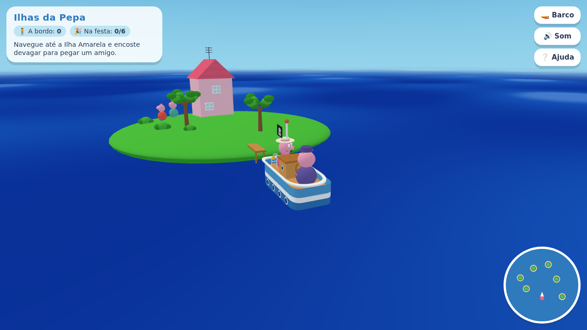
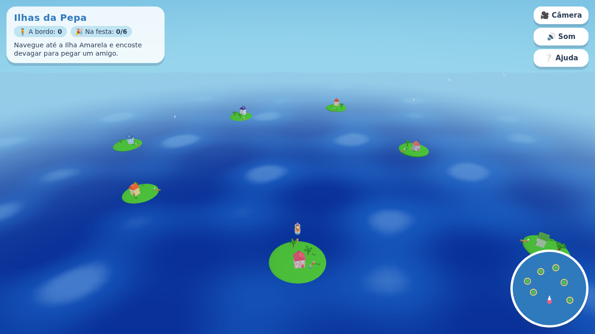
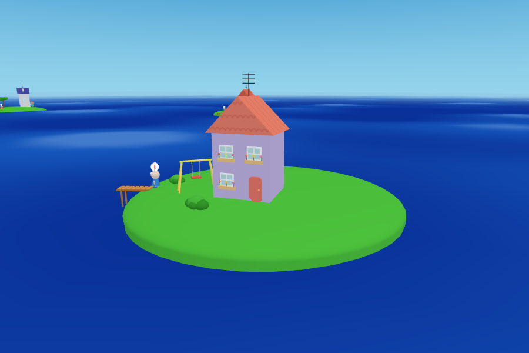

# Ilhas da Pepa 🚤

Jogo em [three.js](https://threejs.org/) inspirado no episódio do passeio de barco:
um mar tranquilo, várias ilhas com casinhas coloridas e o barco do Vovô Pig navegando
entre elas. Tudo é modelado com geometria simples e cores chapadas — não há nenhuma
imagem ou modelo 3D externo no projeto.



| O arquipélago inteiro | Um amigo esperando carona |
| --- | --- |
|  |  |

## Jogar online

**[ricardopera.github.io/Pepas-Island](https://ricardopera.github.io/Pepas-Island/)**

O site é publicado pelo workflow `.github/workflows/pages.yml` a cada push: o
repositório inteiro é o site, porque o jogo é estático e não precisa de build.
Para isso funcionar, o repositório precisa ser público e o GitHub Pages precisa
estar com a origem **GitHub Actions** (Settings → Pages → Source).

## Rodar localmente

```bash
npm start          # abre em http://localhost:5173
```

Qualquer servidor estático serve — o jogo é HTML + módulos ES puros. Não dá para abrir
o `index.html` direto pelo `file://` porque o navegador bloqueia módulos ES nesse
protocolo; por isso o `npm start` sobe um servidor mínimo (`server.mjs`, sem dependências).

### Objetivo

Seis amigos esperam carona, um em cada ilha (marcadas com um círculo amarelo no mapa e
com um balãozinho de exclamação sobre a cabeça). Encoste devagar em cada ilha para eles
embarcarem e leve todos até a **Ilha da Família Pig**, a ilha rosa do mapa, onde vai
acontecer a festa.

### Controles

| Tecla | Ação |
| --- | --- |
| `W` / `↑` | acelera |
| `S` / `↓` | ré |
| `A` `D` / `←` `→` | leme |
| `C` | alterna entre pilotar o barco e a câmera livre |
| `H` | toca o sino do barco |
| `R` | recoloca a câmera atrás do barco |

O botão `▾` no canto do painel de missão recolhe o painel quando ele atrapalha a
vista, e `⛶ Tela cheia` põe o jogo em tela cheia (o botão some sozinho nos
navegadores sem a API, como o do iPhone).

O mouse gira a vista (arrastar) e aproxima (rolagem) nos dois modos. No modo câmera
livre, `WASD` desliza a vista sobre o mar.

No celular aparece um analógico no canto inferior esquerdo: arraste a manopla na
direção do movimento. Ele é proporcional — perto do centro o barco anda devagar e
faz curvas abertas, no limite da borda vai a toda. Serve aos dois modos: pilota o
barco ou desliza a câmera.

## Os dois modos

- **Barco** — a câmera segue o barco e volta sozinha para trás dele conforme você navega,
  respeitando a altura e a distância que você escolheu.
- **Câmera** — o barco fica parado e você sobrevoa o arquipélago livremente, como nas
  cenas em que dá para ver todas as ilhas de uma vez.

## Estrutura

```
index.html          página e HUD
styles.css          interface (painel, mapa, botões, telas de início e vitória)
server.mjs          servidor estático mínimo para desenvolvimento
src/
  main.js           inicialização, laço de animação e teclas globais
  game.js           o arquipélago, os passageiros e a lógica da missão
  world.js          mar, céu, sol, nuvens, gaivotas e luzes
  island.js         monta cada ilha (calota de grama, casa, quintal, cais)
  house.js          casas de duas águas com telhas, janelas, antena e trepadeira
  props.js          árvores, arbustos, balanço, cais e flores
  character.js      personagens (porco, cão e coelho) e suas animações
  boat.js           o barco, a tripulação, a espuma e a física da navegação
  controls.js       entrada de teclado/toque e as duas câmeras
  hud.js            painel de missão, mensagens e minimapa
  joystick.js       analógico de toque (arrasto proporcional)
  audio.js          efeitos sonoros sintetizados no navegador
  materials.js      materiais chapados reaproveitados e formas utilitárias
  textures.js       texturas geradas em canvas (telhas, bandeira pirata)
  palette.js        as cores tiradas dos quadros de referência
vendor/             three.js r185 e OrbitControls (cópia local, jogo roda offline)
```

## Detalhes de implementação

- **Mar** — um plano com deslocamento de vértices num `ShaderMaterial`. A mesma fórmula
  de onda existe em JavaScript (`waveHeight`), então o barco boia exatamente na altura
  certa da onda. O mar, o céu e o sol acompanham a câmera: o mundo nunca tem fim à vista.
- **Casco** — construído anel por anel em vez de extrudado, para as faixas de cor
  (azul claro, listra branca e azul escuro) saírem retas e nítidas como no desenho.
- **Estilo chapado** — luz ambiente forte com um pouco de direcional, materiais Lambert
  e nenhuma textura fotográfica; as únicas texturas são desenhadas em `<canvas>`.
- **Sem build** — nada de bundler ou instalação: os módulos ES são carregados direto pelo
  navegador via `importmap`, e o three.js está versionado em `vendor/`.
